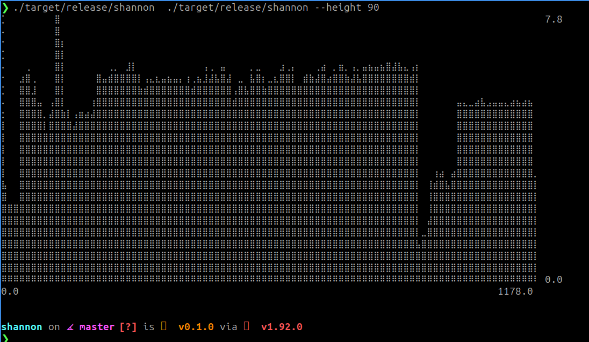

# Shannon

A Rust CLI utility that calculates and visualizes block-wise Shannon entropy of files.

Shannon is available on [crates.io](https://crates.io/crates/shannon-cli) and on [github](https://github.com/ali-raheem/shannon).

## What is Shannon Entropy?

Shannon entropy measures the randomness or information density in data. Values range from 0 to 8 bits per byte:

- **0**: Completely uniform (e.g., a file of all zeros)
- **~4-5**: Typical text or code
- **~7-8**: High randomness (encrypted or compressed data)

## Use Cases

- **Malware analysis**: Identify packed or encrypted sections in executables
- **File forensics**: Detect hidden or embedded data within files
- **Compression analysis**: Visualize which parts of a file are already compressed
- **Binary reverse engineering**: Understand file structure and locate data regions

## Screenshot



## Installation

### Via crates.io

```bash
cargo add shannon-cli
```

### Local build

```bash
cargo build --release
```

The binary will be at `target/release/shannon`.

## Usage

```bash
shannon <input_file> [OPTIONS]
```

### Options

| Option | Short | Default | Description |
|--------|-------|---------|-------------|
| `--block-size` | `-b` | 1024 | Block size in bytes for entropy calculation |
| `--width` | | 180 | Chart width in characters |
| `--height` | | 100 | Chart height in characters |
| `--y-max` | `-y` | auto | Maximum Y-axis value (defaults to max entropy found) |

### Examples

Analyze a binary with default settings:
```bash
shannon /usr/bin/ls
```

Use smaller blocks for finer granularity:
```bash
shannon firmware.bin --block-size 256
```

Compact output for smaller terminals:
```bash
shannon large_file.dat --width 80 --height 40
```

## Output

The tool renders a bar chart in the terminal where:
- **X-axis**: Block index (position in file)
- **Y-axis**: Entropy value (0-8 bits per byte)

High entropy regions appear as tall bars, making it easy to spot encrypted or compressed sections at a glance.

## License

MIT
